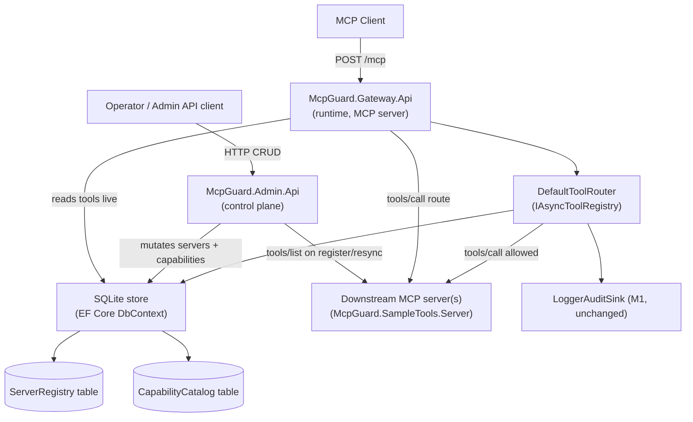
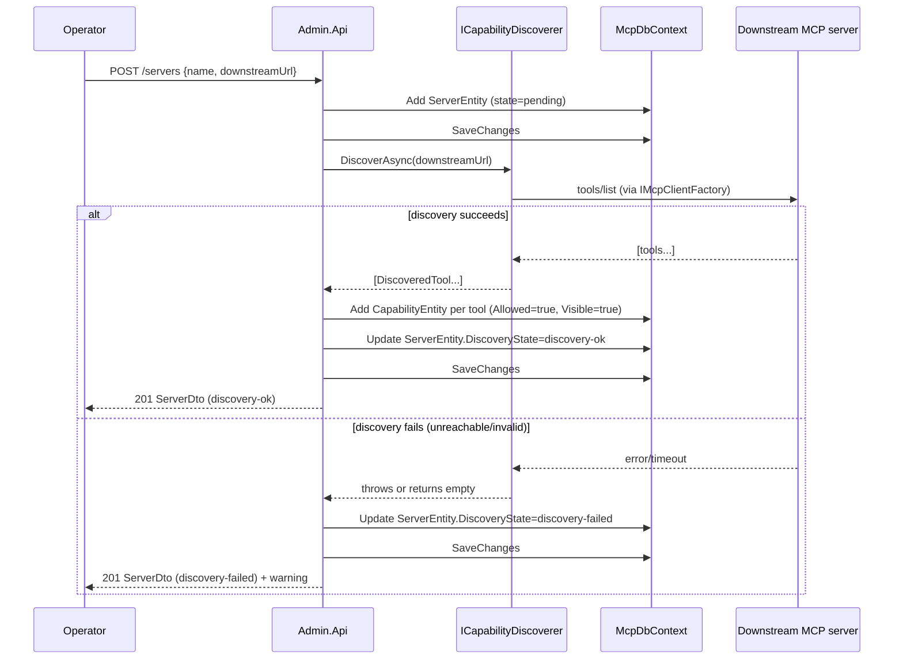
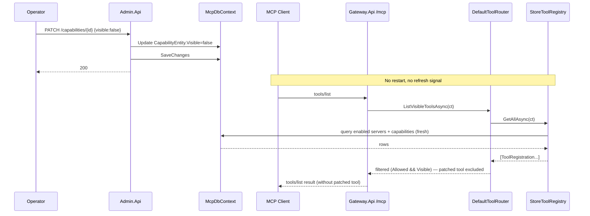
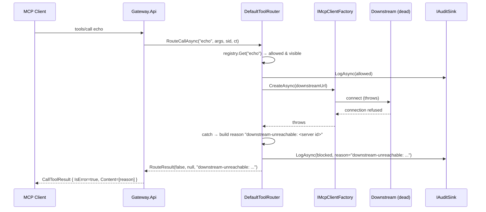

# M2 — Admin-Controlled Tool Registry — Design

Companion to `spec.md`. Defines HOW to build M2: architecture, components, interfaces, data
models, DI wiring deltas vs M1, sequence diagrams, error strategy, and the ORM decision.

**Spec:** `.specs/features/m2-admin-tool-registry/spec.md`
**Context:** `.specs/features/m2-admin-tool-registry/context.md`
**Status:** Draft

---

## Architecture Overview

M2 adds a control-plane slice (Admin API + SQLite store + capability discovery) and rewires
the runtime's tool-registry source from M1's static `ConfigToolRegistry` to a store-backed
`StoreToolRegistry` behind a new `IAsyncToolRegistry`. M1's sync `IToolRegistry` and its
tests stay untouched (additive, not breaking).

The gateway and the Admin API run in **one process** for M2 (they are separate
`Microsoft.NET.Sdk.Web` projects but share the store via a common `DbContext`). The Admin API
mutates the store; the gateway reads from it live on every `tools/list`/`tools/call` (no
cache, 0-second refresh window). A separate-process split is a future-milestone concern
(M2-N8).



### Project reference graph (M2, compile-time)

```
McpGuard.Admin.Api                    (control plane — new refs in M2)
├── McpGuard.ServerRegistry           (models + DbContext)
├── McpGuard.CapabilityCatalog        (models + discovery service)
└── McpGuard.HealthChecks             (downstream reachability health check)

McpGuard.ServerRegistry               (new: EF Core entities + McpDbContext)
├── McpGuard.CapabilityCatalog        (Capability entity lives here, shared store)
└── (EF Core packages)

McpGuard.CapabilityCatalog            (new: ICapabilityDiscoverer + SDK-backed impl)
└── McpGuard.McpClient.Sdk            (reuse M1 downstream client for tools/list)

McpGuard.HealthChecks                 (new: DownstreamHealthCheck)
└── McpGuard.ServerRegistry           (to enumerate servers)

McpGuard.Gateway.Api                  (runtime — rewired for async registry)
├── McpGuard.ToolRegistry              (unchanged: IToolRegistry, ConfigToolRegistry)
├── McpGuard.ToolRouter                (widened: depends on IAsyncToolRegistry)
├── McpGuard.Audit                     (unchanged)
├── McpGuard.McpClient.Sdk             (unchanged)
├── McpGuard.ServerRegistry            (NEW ref: StoreToolRegistry reads from DbContext)
└── McpGuard.ToolRouter                (already referenced)

McpGuard.ToolRouter                   (widened)
├── McpGuard.ToolRegistry              (unchanged + new IAsyncToolRegistry added here)
└── McpGuard.Audit                     (unchanged)
```

**Key wiring change:** `McpGuard.ToolRegistry` gains the new `IAsyncToolRegistry` interface
and a `ToolRegistration`-extension (no breaking change to the existing record or
`ConfigToolRegistry`). `StoreToolRegistry` lives in `McpGuard.ServerRegistry` (it owns the
store) and implements `IAsyncToolRegistry`. `DefaultToolRouter` switches its dependency from
`IToolRegistry` to `IAsyncToolRegistry`. `McpGatewayHandler` switches `ListVisibleTools` to
async.

### Empty-stub projects that stay unreferenced in M2

`McpGuard.Auth`, `McpGuard.Policy`, `McpGuard.DlpContext`, `McpGuard.Redaction`,
`McpGuard.Secrets`, `McpGuard.Observability`, `McpGuard.PolicyStore`,
`McpGuard.TenantSettings`, `McpGuard.Approvals`, `McpGuard.DlpPolicyStore`,
`McpGuard.RedactionRules`, `McpGuard.SecretsProvider`. All stay as `Class1` placeholder stubs.

---

## Code Reuse Analysis

### Existing Components to Leverage

| Component                | Location                                              | How to Use                                                                         |
| ------------------------ | ----------------------------------------------------- | ---------------------------------------------------------------------------------- |
| `IToolRegistry` / `ConfigToolRegistry` | `src/runtime/McpGuard.ToolRegistry/`     | **Leave unchanged.** M1 tests stay green. Keep registered for compatibility.      |
| `ToolRegistration` record | `src/runtime/McpGuard.ToolRegistry/ToolRegistration.cs` | **Widen** with optional `ServerId`, `InputSchema`, `Enabled` (see Data Models). Additive — existing M1 ctor calls stay valid via a default-valued overload or a new record. |
| `IAuditSink` / `LoggerAuditSink` | `src/runtime/McpGuard.Audit/`                | **Reuse unchanged** for the downstream-unreachable `tools.call.blocked` event.      |
| `IMcpClientFactory` / `SdkMcpClientFactory` | `src/runtime/McpGuard.ToolRouter/`, `src/runtime/McpGuard.McpClient.Sdk/` | **Reuse** in `CapabilityDiscoverer` to call `tools/list` on downstream servers during register/resync. |
| `AuditEvent` record | `src/runtime/McpGuard.Audit/AuditEvent.cs`      | **Reuse as-is.** The downstream-unreachable path emits the same record shape with `Outcome="tools.call.blocked"`. |
| `RouteResult` record | `src/runtime/McpGuard.ToolRouter/RouteResult.cs`  | **Reuse as-is.** Returns `(false, null, "downstream-unreachable: ...")`.             |
| Integration test fixture (Kestrel + Testcontainers pattern) | `tests/McpGuard.Gateway.Api.Tests/` | **Reuse the pattern.** M2 integration tests extend the same real-Kestrel + raw JSON-RPC + Testcontainers approach for the downstream; add a temp-file SQLite for the store. |

### Integration Points

| System                | Integration Method                                                                                  |
| --------------------- | -------------------------------------------------------------------------------------------------- |
| Admin API ↔ Store      | EF Core `McpDbContext` (DI-scoped). Admin API controllers take a `McpDbContext` and SaveChanges.    |
| Gateway ↔ Store       | `StoreToolRegistry` takes a scoped `IDbContextFactory<McpDbContext>` (the gateway runs the MCP server as singletons; the DbContext lookup is scoped per request via the factory). |
| Admin API ↔ Downstream | `ICapabilityDiscoverer` uses `IMcpClientFactory` (from M1) to call `tools/list` on the downstream URL during register/resync. |
| Gateway ↔ Downstream   | Unchanged from M1: `DefaultToolRouter` → `IMcpClientFactory` → `SdkMcpDownstreamClient.CallToolAsync`. |

### Concerns (from `.specs/codebase/`)

`.specs/codebase/CONCERNS.md` does not exist yet. The stale `STRUCTURE.md` (still describes the
pre-M1 "20 projects, no refs" snapshot) will be refreshed as a small M2 docs task to reflect
the M1+M2 wiring, so future milestones don't plan against a stale map.

---

## Components

### `McpGuard.ServerRegistry` (new in M2)

- **Purpose**: Owns the `ServerRegistry` EF Core entity, the `McpDbContext`, and the
  `StoreToolRegistry` (`IAsyncToolRegistry` impl). The central store seam for M2.
- **Location**: `src/controlplane/McpGuard.ServerRegistry/`
- **Interfaces**:
  - `McpDbContext : DbContext` — `DbSet<ServerEntity> Servers`, `DbSet<CapabilityEntity> Capabilities`. `OnModelCreating` configures tables, indexes, and the `server_id` FK from capabilities → servers.
  - `IAsyncToolRegistry` (defined in `McpGuard.ToolRegistry`, see below) — implemented by `StoreToolRegistry`.
  - `StoreToolRegistry : IAsyncToolRegistry` — ctor takes `IDbContextFactory<McpDbContext>`. `GetAllAsync` opens a scope, queries `Servers` + `Capabilities` (enabled only), maps to `ToolRegistration`. `GetAsync` queries by tool name. Live read, no cache.
- **Dependencies**: `Microsoft.EntityFrameworkCore.Sqlite`, `Microsoft.EntityFrameworkCore.Design` (design-time for migrations), `McpGuard.ToolRegistry` (for `IAsyncToolRegistry` + `ToolRegistration`), `McpGuard.CapabilityCatalog` (for the `CapabilityEntity` shape; alternatively the entity lives here and `CapabilityCatalog` references it — see Data Models).
- **Reuses**: `ToolRegistration` (widened), `IAsyncToolRegistry` (new).

### `McpGuard.CapabilityCatalog` (new in M2)

- **Purpose**: Owns capability discovery (`tools/list` on downstream) and the
  `CapabilityEntity` metadata shape. Called by the Admin API on register/resync.
- **Location**: `src/controlplane/McpGuard.CapabilityCatalog/`
- **Interfaces**:
  - `ICapabilityDiscoverer` — `Task<IReadOnlyList<DiscoveredTool>> DiscoverAsync(Uri downstreamUrl, CancellationToken ct)` and `Task<IReadOnlyList<DiscoveredTool>> DiscoverAsync(string serverId, CancellationToken ct)` (overload for resync by id, looks up the URL from the store).
  - `SdkCapabilityDiscoverer : ICapabilityDiscoverer` — uses `IMcpClientFactory` to create a downstream client, calls `ListToolsAsync`, maps each `Tool` to a `DiscoveredTool { Name, Description, InputSchema }`.
  - `DiscoveredTool` record — `(string Name, string Description, JsonElement? InputSchema)`.
- **Dependencies**: `McpGuard.McpClient.Sdk` (for `IMcpClientFactory`), `McpGuard.ServerRegistry` (for the resync-by-id lookup), `ModelContextProtocol` (SDK types).
- **Reuses**: M1's `IMcpClientFactory` + `SdkMcpClientFactory`.

> **Note:** `IMcpDownstreamClient` (M1) only exposes `CallToolAsync`. To call `tools/list`
> the discoverer needs either (a) a new method on `IMcpDownstreamClient` (`ListToolsAsync`)
> or (b) direct use of the SDK `IMcpClient` from `SdkMcpClientFactory.CreateAsync` (the
> factory returns `IMcpDownstreamClient`, so we'd widen that interface). Design choice:
> **widen `IMcpDownstreamClient` with `ListToolsAsync`** (additive — M1's `SdkMcpDownstreamClient`
> gains a thin pass-through to `IMcpClient.ListToolsAsync`). M1's `DefaultToolRouter` doesn't
> call it; M1 tests' `FakeMcpDownstreamClient` adds a no-op or throw impl. This keeps the
> factory seam intact and avoids a second factory.

### `McpGuard.HealthChecks` (new in M2)

- **Purpose**: Downstream reachability health check, surfaced via the Admin API `/health`.
- **Location**: `src/controlplane/McpGuard.HealthChecks/`
- **Interfaces**:
  - `DownstreamHealthCheck : IHealthCheck` — ctor takes `IDbContextFactory<McpDbContext>` + `IMcpClientFactory`. `CheckHealthAsync` enumerates enabled servers, probes each via a lightweight `initialize`/`tools/list` (or an HTTP HEAD on the downstream URL), tags each result with the server id, returns `Healthy` only if all enabled servers respond.
  - `DownstreamHealthCheckOptions` — optional config (timeout per server).
- **Dependencies**: `Microsoft.Extensions.Diagnostics.HealthChecks`, `McpGuard.ServerRegistry`, `McpGuard.McpClient.Sdk`.
- **Reuses**: `IMcpClientFactory` for probing. The health check probes via `tools/list` (per
  user decision 2026-07-16) — the same MCP path the gateway uses for real calls, so
  reachability signals are truthful. A short timeout (default 5s, configurable in
  `DownstreamHealthCheckOptions`) prevents a slow server from stalling `/health`.

### `McpGuard.Admin.Api` (rewired in M2)

- **Purpose**: HTTP CRUD surface for operators to register servers, trigger discovery/resync,
  toggle capability allowlist/visibility, and read health. Stays a standalone
  `Microsoft.NET.Sdk.Web` application per user decision (2026-07-16).
- **Location**: `src/controlplane/McpGuard.Admin.Api/`
- **Interfaces** (minimal-API endpoints, grouped):
  - `POST /servers` — register server (body: `{name, downstreamUrl, enabled?}`) → 201 with server dto; triggers `ICapabilityDiscoverer.DiscoverAsync(downstreamUrl)`; on success persists capabilities; on discovery failure persists server with `discovery-failed` state and returns 201 + warning. (M2-R1, R7, R8)
  - `GET /servers` → 200 list of server dtos. (M2-R3)
  - `GET /servers/{id}` → 200 or 404. (M2-R4)
  - `PUT /servers/{id}` → 200 or 404; updates name/downstreamUrl/enabled. (M2-R5)
  - `DELETE /servers/{id}` → 204 or 404. (M2-R6)
  - `POST /servers/{id}/resync` → 200 (re-discovers, replaces capabilities, updates synced-at) or 404. (M2-R9, R10)
  - `PATCH /capabilities/{id}` — body: `{allowed?, visible?}` → 200 or 404. (M2-R11, R12, R15)
  - `GET /capabilities` → 200 list. (M2-R28)
  - `GET /capabilities/{id}` → 200 or 404. (M2-R29)
  - `GET /servers/{id}/capabilities` → 200 list or 404. (M2-R27)
  - `GET /health` → 200 (all healthy) or 503 (any unreachable) with per-server status. (M2-R22)
- **Program.cs**: `WebApplication.CreateBuilder` → `AddDbContextFactory<McpDbContext>(UseSqlite)` → `AddCapabilityDiscoverer` → `AddHealthChecks().AddCheck<DownstreamHealthCheck>()` → `AddMcpClientFactory()` → build → `MapAdminEndpoints()` (an extension method grouping the routes above) → `MapHealthChecks("/health")` → `db.Database.MigrateAsync()` on startup → `Run()`.
- **Dependencies**: `McpGuard.ServerRegistry`, `McpGuard.CapabilityCatalog`, `McpGuard.HealthChecks`, `Microsoft.EntityFrameworkCore.Sqlite`, `Microsoft.Extensions.Diagnostics.HealthChecks`.
- **Reuses**: EF Core `McpDbContext`; M1's `IMcpClientFactory` via `ICapabilityDiscoverer`.
- **Auth**: none in M2 (deferred to M3 per `context.md`). A README note flags the open surface.

### `McpGuard.ToolRegistry` (widened in M2, non-breaking)

- **Purpose**: Adds `IAsyncToolRegistry` alongside M1's sync `IToolRegistry`. Widens
  `ToolRegistration` with optional capability metadata.
- **Location**: `src/runtime/McpGuard.ToolRegistry/`
- **New types**:
  - `IAsyncToolRegistry` — `Task<IReadOnlyList<ToolRegistration>> GetAllAsync(CancellationToken ct)` and `Task<ToolRegistration?> GetAsync(string name, CancellationToken ct)`.
  - `ToolRegistration` (widened) — see Data Models. The existing 5-arg ctor is preserved; new fields default so M1's `ConfigToolRegistry` compiles unchanged.
- **Unchanged**: `IToolRegistry`, `ConfigToolRegistry`, `ToolRegistryOptions`, `ToolEntry`, and all M1 tests.

### `McpGuard.ToolRouter` (widened in M2)

- **Purpose**: `DefaultToolRouter` switches to `IAsyncToolRegistry` and gains the
  downstream-unreachable try/catch.
- **Location**: `src/runtime/McpGuard.ToolRouter/`
- **Changes**:
  - `IToolRouter.ListVisibleTools` → `Task<IReadOnlyList<ToolRegistration>> ListVisibleToolsAsync(CancellationToken ct)` (was sync). `McpGatewayHandler.ListToolsAsync` awaits it.
  - `DefaultToolRouter` ctor: `IToolRegistry` → `IAsyncToolRegistry`. `Get`/`GetAll` calls become `GetAsync`/`GetAllAsync`.
  - `RouteCallAsync`: wrap the downstream `CreateAsync`/`CallToolAsync` in try/catch (see Error Strategy). Behavior for blocked/allowed paths is otherwise identical to M1.
- **Unchanged**: `RouteResult`, `IMcpClientFactory`, `IMcpDownstreamClient` (gains `ListToolsAsync` — see CapabilityCatalog note), `IMcpDownstreamClient` fakes in tests add the new method.
- **Reuses**: `IAuditSink`, `AuditEvent`, `RouteResult` unchanged.

### `McpGuard.Gateway.Api` (rewired in M2)

- **Purpose**: Swaps the registry source to `StoreToolRegistry` (read-only against the shared
  SQLite file) and cleans up the M1 `Program.cs` duplicate.
- **Location**: `src/runtime/McpGuard.Gateway.Api/`
- **`Program.cs` changes**:
  - Add `builder.Services.AddDbContextFactory<McpDbContext>(opt => opt.UseSqlite(connStr))` where `connStr` comes from `McpGuard:Store:SqlitePath`. Enable SQLite WAL mode in `McpDbContext.OnConfiguring`.
  - Add `builder.Services.AddSingleton<IAsyncToolRegistry, StoreToolRegistry>()` (store-backed; takes `IDbContextFactory<McpDbContext>`).
  - Keep `builder.Services.AddSingleton<IToolRegistry, ConfigToolRegistry>()` (compat, unused by router in M2).
  - Change `DefaultToolRouter` registration to resolve `IAsyncToolRegistry` instead of `IToolRegistry`.
  - `McpGatewayHandler.ListToolsAsync` forwards `InputSchema` from each `ToolRegistration` to the SDK `Tool` descriptor (per user decision 2026-07-16). M1 behavior change: `tools/list` now carries schemas.
  - Clean up the duplicate `UseHttpsRedirection` + `MapMcp("/mcp")` block (M2-R32).
- **Reuses**: all M1 wiring; the MCP SDK handler shape is unchanged.

### Process hosting (M2 choice)

**Two applications, one SQLite file:** `McpGuard.Gateway.Api` (runtime, MCP `/mcp`) and
`McpGuard.Admin.Api` (control plane, Admin API) stay **separate `Microsoft.NET.Sdk.Web`
applications**, each runnable on its own port. They share the **same SQLite file on disk**,
each with its own `IDbContextFactory<McpDbContext>`. The Admin API writes; the gateway reads
live on every `tools/list`/`tools/call` (no cache, 0-second window). SQLite's file-flush
behavior makes Admin API commits visible to the gateway within milliseconds — fast enough
for the M2 exit criterion ("Runtime gateway behavior uses registry data from the control
plane or an equivalent shared source").

`McpGuard.Admin.Api` stays a `Microsoft.NET.Sdk.Web` host with its own `Program.cs` mapping
the admin endpoints (server registration, capability discovery/resync, allowlist/visibility
PATCH, `/health`). It references `McpGuard.ServerRegistry`, `McpGuard.CapabilityCatalog`, and
`McpGuard.HealthChecks`, configures `McpDbContext` against the shared SQLite file, and applies
migrations on startup. `McpGuard.Gateway.Api` adds `McpGuard.ServerRegistry` as a project
reference, configures its own `IDbContextFactory<McpDbContext>` against the same SQLite file
(read-only access pattern — it never writes), and registers `StoreToolRegistry` as the
`IAsyncToolRegistry`.

**Connection string:** a shared config value `McpGuard:Store:SqlitePath` (default
`./mcpguard.db`) read by both applications. Integration tests use a temp-file path cleaned up
in `IAsyncLifetime.DisposeAsync`.

> Concurrency note: SQLite supports concurrent readers + a single writer at a time; EF Core
> handles the file-locking retry. The gateway is read-only and never contends for the writer
> lock. WAL mode (`PRAGMA journal_mode=WAL`) is enabled on both connections to allow
> concurrent reads during a write — set in `OnConfiguring` or via the connection string
> (`Mode=ReadWriteCreate;Cache=Shared`). This keeps the live-read 0-second window honest
> without a separate pub/sub channel.

> Alternative considered: one process with the gateway hosting the admin endpoints.
> Rejected per user decision (2026-07-16): the Admin API should remain a standalone
> application for separate-port deployment and independent testability. The shared-file
> approach keeps the live-read story simple without forcing a process merge.

---

## Data Models

### SQLite schema (EF Core entities)

```csharp
public sealed class ServerEntity
{
    public string Id { get; set; } = Guid.NewGuid().ToString("N");
    public string Name { get; set; } = "";
    public Uri DownstreamUrl { get; set; } = new("http://localhost");
    public bool Enabled { get; set; } = true;
    public string DiscoveryState { get; set; } = "pending"; // pending | discovery-ok | discovery-failed
    public DateTimeOffset CreatedAt { get; set; } = DateTimeOffset.UtcNow;
    public DateTimeOffset UpdatedAt { get; set; } = DateTimeOffset.UtcNow;
    public List<CapabilityEntity> Capabilities { get; set; } = new();
}

public sealed class CapabilityEntity
{
    public string Id { get; set; } = Guid.NewGuid().ToString("N");
    public string ServerId { get; set; } = "";       // FK → ServerEntity.Id
    public ServerEntity Server { get; set; } = null!; // nav
    public string ToolName { get; set; } = "";
    public string Description { get; set; } = "";
    public string? InputSchemaJson { get; set; }     // JSON-encoded input schema (nullable for tools without one)
    public bool Allowed { get; set; } = true;
    public bool Visible { get; set; } = true;
    public DateTimeOffset SyncedAt { get; set; } = DateTimeOffset.UtcNow;
}
```

**Relationships**: `CapabilityEntity.ServerId` → `ServerEntity.Id` (one-to-many, cascade
delete: deleting a server removes its capabilities). Index on
`(ServerId, ToolName)` unique — a server can't register the same tool name twice.

**Migrations**: EF Core design-time migrations. `McpDbContext` factory configured in
`Program.cs`. On startup, `db.Database.MigrateAsync()` applies pending migrations and creates
the file if absent (M2 edge case: "WHEN the SQLite store file does not exist on startup THEN
the system SHALL create it and apply migrations").

### `ToolRegistration` (widened — non-breaking)

```csharp
public sealed record ToolRegistration(
    string Name,
    string Description,
    Uri DownstreamUrl,
    bool Allowed,
    bool Visible,
    string? ServerId = null,          // NEW in M2 — the server this tool belongs to
    JsonElement? InputSchema = null,  // NEW in M2 — from CapabilityCatalog
    string? CapabilityId = null);     // NEW in M2 — for the Admin API PATCH path
```

The 5-arg M1 ctor is still valid (new params default). `ConfigToolRegistry` ctor calls stay
unchanged (passes 5 args, new fields default to `null`). `StoreToolRegistry` populates all 8.
M1's `McpGatewayHandler.ListToolsAsync` can optionally start forwarding `InputSchema` to the
SDK `Tool` descriptor (see Open question below).

### Admin API DTOs (request/response)

```csharp
public sealed record RegisterServerRequest(string Name, Uri DownstreamUrl, bool Enabled = true);
public sealed record ServerDto(string Id, string Name, Uri DownstreamUrl, bool Enabled, string DiscoveryState, DateTimeOffset CreatedAt, DateTimeOffset UpdatedAt);
public sealed record CapabilityDto(string Id, string ServerId, string ToolName, string Description, string? InputSchemaJson, bool Allowed, bool Visible, DateTimeOffset SyncedAt);
public sealed record PatchCapabilityRequest(bool? Allowed, bool? Visible);
public sealed record ResyncResultDto(string ServerId, int ToolsDiscovered, DateTimeOffset SyncedAt, string? Warning);
```

### `DiscoveredTool` (CapabilityCatalog)

```csharp
public sealed record DiscoveredTool(string Name, string Description, JsonElement? InputSchema);
```

---

## Sequence Diagrams

### Register a downstream server + auto-discover (M2-R1, R7, R8)



### Live-read `tools/list` after an allowlist change (M2-R11, R12, R20)



### Downstream-unreachable failure path (M2-R24, R25, R26)



---

## Error Handling Strategy

| Error Scenario                                     | Handling                                                                                          | User Impact                                                                 |
| -------------------------------------------------- | ------------------------------------------------------------------------------------------------- | --------------------------------------------------------------------------- |
| Invalid server payload (missing/malformed URL)    | Admin API returns 400 with field-level validation error (M2-R2).                                 | Operator sees which field is invalid.                                      |
| Discovery fails on register (unreachable/non-2xx)  | Server persisted with `discovery-failed`, 201 + warning, no capabilities written (M2-R8).         | Server record exists; operator can resync later.                           |
| Resync on unknown server id                         | 404 (M2-R10).                                                                                      | Operator sees the id was not found.                                        |
| PATCH on unknown capability id                       | 404 (M2-R15).                                                                                      | Operator sees the id was not found.                                        |
| Downstream unreachable during `tools/call`          | `DefaultToolRouter` catches, emits `tools.call.blocked` audit with `downstream-unreachable: <server id>` reason, returns `RouteResult(false, null, reason)`; gateway returns `CallToolResult { IsError=true }` (M2-R24, R25, R26). | Client gets a clear `isError` result; audit shows the failure; no unhandled exception. |
| SQLite store file absent on startup                 | `db.Database.MigrateAsync()` creates it + applies migrations (edge case).                         | Gateway starts clean.                                                       |
| Store locked / unreadable at startup                | Gateway fails fast with a clear startup error (edge case).                                        | Operator sees the store path/permissions are wrong.                        |
| Duplicate `(serverId, toolName)` on resync          | Replace-in-place: resync deletes then re-adds capabilities for that server (M2-R9).                | No duplicate rows; synced-at updates.                                      |
| Call to a tool whose server was deleted mid-flight  | The in-flight call completes best-effort; subsequent calls block as unknown-tool (edge case).      | One call may succeed; later calls are blocked.                             |

**Exception-leak rule:** the `downstream-unreachable` `Reason` string MUST NOT include
exception messages, stack traces, or connection internals. Format:
`"downstream-unreachable: <serverId>"` — the server id is enough for the operator to find
the row in the store; the health check pinpoints reachability.

---

## Tech Decisions

| Decision                       | Choice                                 | Rationale                                                                                                                                                          |
| ------------------------------ | ------------------------------------- | ------------------------------------------------------------------------------------------------------------------------------------------------------------------ |
| ORM for SQLite store           | **EF Core 10.0.10**                   | Matches the .NET 10 SDK and the existing `Microsoft.Extensions.*` 10.0.9 pins. Gives `DbContext` + migrations + a natural CRUD query surface for the Admin API. Dapper rejected: hand-rolled migrations/mapping aren't worth the package savings for M2's small schema. |
| Store hosting                  | **Two apps, one SQLite file**        | Per user decision (2026-07-16): Admin API stays a standalone `Sdk.Web` app. Both apps point at the same SQLite file with WAL mode for concurrent read during write. Splitting is already done — no future work needed unless the control plane moves off-box. |
| Async registry interface       | **New `IAsyncToolRegistry` alongside** | User decision (context.md §2). M1 `IToolRegistry`/`ConfigToolRegistry` and tests stay untouched (additive). Router is already async, so widening is low risk.      |
| `IMcpDownstreamClient` for discovery | **Widen with `ListToolsAsync`**   | Additive method; `SdkMcpDownstreamClient` adds a pass-through to `IMcpClient.ListToolsAsync`; M1 fakes add a no-op/throw. Keeps one factory seam.                |
| Refresh model                   | **Live read, no cache**                | User decision (context.md §5). 0-second window. Cheap because the store is in-process SQLite. Push/TTL deferred.                                                  |
| Capability discovery trigger    | **On register + `/resync` endpoint**  | User decision (context.md §4). Matches M1 `design.md:91-93`.                                                                                                       |
| `ToolRegistration` widening      | **Add default-valued fields**          | Non-breaking: M1 ctor calls stay valid; M1 tests stay green.                                                                                                       |
| Downstream-unreachable reason   | **`downstream-unreachable: <serverId>`** | No exception internals leaked; operator can find the server row.                                                                                                |
| M1 spec reconciliation (R31)     | **Canonicalize `isError` in M1 spec**  | Lower risk, matches the SDK `CallToolResult { IsError = true }` contract. Removes the `-32602` envelope clause from `spec.md:22` + `design.md:232-250`.            |

### Packages to add to `Directory.Packages.props`

```
Microsoft.EntityFrameworkCore.Sqlite        10.0.10
Microsoft.EntityFrameworkCore.Design       10.0.10  (private assets, design-time)
Microsoft.Extensions.Diagnostics.HealthChecks  10.0.9  (matches the Extensions pins)
```

(MCP SDK stays at 1.4.0. No auth packages — deferred to M3.)

---

## Resolved design questions (user decisions, 2026-07-16)

1. **Should `McpGatewayHandler.ListToolsAsync` forward `InputSchema` to the SDK `Tool`
   descriptor in M2?** — **Yes.** M2's `tools/list` now carries the input schema from
   `CapabilityCatalog`. This is the point of having the catalog. M1's `Tool { Name,
   Description }` output widens to `Tool { Name, Description, InputSchema }`. Covered in the
   `McpGuard.Gateway.Api` component section above.

2. **`McpGuard.Admin.Api` — library or standalone application?** — **Standalone application.**
   It stays a `Microsoft.NET.Sdk.Web` host on its own port. The gateway and the Admin API
   share the same SQLite file on disk, each with its own `IDbContextFactory<McpDbContext>`.
   See the "Process hosting" section above.

3. **Health check probe method** — **`tools/list`** via `IMcpClientFactory` with a short
   timeout. Truthful (same path as real calls) over lightweight. See the `McpGuard.HealthChecks`
   component section.

---

## Traceability (Requirement → Component)

| Requirement | Implemented in                                                                                       |
| ----------- | --------------------------------------------------------------------------------------------------- |
| M2-R1       | Admin.Api `POST /servers` + `ServerRegistry.ServerEntity` + `McpDbContext`                          |
| M2-R2       | Admin.Api request validation (`RegisterServerRequest` URL parse)                                    |
| M2-R3       | Admin.Api `GET /servers`                                                                             |
| M2-R4       | Admin.Api `GET /servers/{id}`                                                                        |
| M2-R5       | Admin.Api `PUT /servers/{id}`                                                                       |
| M2-R6       | Admin.Api `DELETE /servers/{id}` + cascade delete on capabilities                                   |
| M2-R7       | `CapabilityCatalog.SdkCapabilityDiscoverer` + Admin.Api register flow                               |
| M2-R8       | Admin.Api register flow `discovery-failed` branch                                                    |
| M2-R9       | Admin.Api `POST /servers/{id}/resync` + `SdkCapabilityDiscoverer` replace-in-place                   |
| M2-R10      | Admin.Api `POST /servers/{id}/resync` 404 branch                                                     |
| M2-R11      | Admin.Api `PATCH /capabilities/{id}` (allowed) + live read                                          |
| M2-R12      | Admin.Api `PATCH /capabilities/{id}` (visible) + live read                                           |
| M2-R13      | `DefaultToolRouter` blocked branch (M1 behavior, now fed by `StoreToolRegistry`)                    |
| M2-R14      | `DefaultToolRouter` `ListVisibleToolsAsync` filter + blocked branch                                  |
| M2-R15      | Admin.Api `PATCH /capabilities/{id}` 404 branch                                                      |
| M2-R16      | `ToolRegistry.IAsyncToolRegistry` (new) + M1 `IToolRegistry` unchanged                              |
| M2-R17      | `ServerRegistry.StoreToolRegistry` (reads `McpDbContext` live)                                      |
| M2-R18      | `ToolRouter.DefaultToolRouter` ctor switched to `IAsyncToolRegistry`                                |
| M2-R19      | `Gateway.Api.Program.cs` DI wiring                                                                   |
| M2-R20      | `StoreToolRegistry` live read (no cache) + Admin.Api mutations                                       |
| M2-R21      | `HealthChecks.DownstreamHealthCheck`                                                                |
| M2-R22      | Admin.Api `GET /health` (200/503)                                                                    |
| M2-R23      | `DownstreamHealthCheck` skips `enabled=false` servers                                                 |
| M2-R24      | `DefaultToolRouter.RouteCallAsync` try/catch + `IAuditSink`                                          |
| M2-R25      | `DefaultToolRouter.RouteCallAsync` returns `RouteResult(false, null, reason)`                       |
| M2-R26      | `McpGatewayHandler.CallToolAsync` `isError` shape (unchanged from M1)                                |
| M2-R27      | Admin.Api `GET /servers/{id}/capabilities`                                                           |
| M2-R28      | Admin.Api `GET /capabilities`                                                                        |
| M2-R29      | Admin.Api `GET /capabilities/{id}`                                                                  |
| M2-R30      | `tests/McpGuard.Gateway.Api.Tests` `IntegrationTestFixture` + tightened audit assertion               |
| M2-R31      | `.specs/features/m1-mvp-tool-gateway/spec.md` + `design.md` edit (canonicalize `isError`)           |
| M2-R32      | `src/runtime/McpGuard.Gateway.Api/Program.cs` duplicate cleanup                                      |